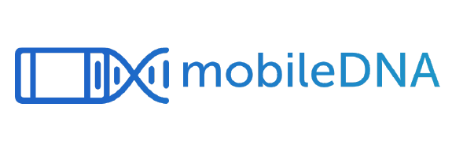

.. -*- mode: rst -*-

.. image:: https://img.shields.io/pypi/dm/mobiledna?color=green&label=Downloads%20PyPi&style=plastic
   :alt: PyPI - Downloads

**mobileDNA** is an open-source statistical package written in Python 3. It can be used to analyze data stemming from the `mobileDNA platform <https://mobiledna.ugent.be>`_. The package contains the following modules:

+ advanced

+ communication

+ core

+ dashboard

The package is intended for researchers/users who like to delve into the raw log data that is provided through the mobileDNA logging application. It can be used and expanded on at will. Go bonkers.

Questions, comments, or just need help?
=======================================

If you have questions, please address `Simon Perneel <Simon.Perneel@UGent.be>`_ or `Kyle Van Gaeveren <Kyle.VanGaeveren@UGent.be>`_.

Installation
============

Dependencies
------------

The main dependencies are :

  * NumPy
  * Pandas
  * TQDM
  * MatPlotLib
  * ElasticSearch (6.3.X)
  * PyArrow
  * CSV

In addition, some functions may require :

  * Seaborn
  * PPrint
  * apyori

mobileDNA is a Python 3 package and is currently tested for Python 3.6 - 3.10. mobileDNA is not expected to work with Python 2.7 and below.

User installation
-----------------

mobileDNA can be easily installed using pip:

.. code-block:: shell

  pip3 install mobiledna

However, new releases are frequent so if you want the latest version, you better fetch the mobileDNA folder from this repo directly. 

The pypi repository doesn't get always updated with a new update of the code. 

Reference
=========

This documentation is under development. Below, you will find more information for each of the package modules.

📡 Communication module 
-----------------------
The communication module is used interface with the IDLab server that stores the mobileDNA data. With its function, one can fetch the mobileDNA appevents/sessions/notifications/connectivity data. 

If you want fetch the latest data, you should generate and restore a snapshot of the server first. 

**Warning** Don't touch this module if you don't have access to the ES server! You need the `config.py` file with the credentials. You will get them if you are authorized 😉.

Find more information about how the functions in the `docs <docs/communication/communication.md>`_.

⏺️ Core module
---------------
The core module contains the main functionality of the package. It is used to load and preprocess the appevents,
sessions and notifications data

Find more information in the `docs <docs/core/>`_.

⚡️ Advanced module
-------------------
This module contains advanced functionality that is not used in the standard workflow. It has some machine learning/
data mining functions that can be used to extract more information from the data. To be improved and expanded.
(e.g. for guessing people's home locations, estimating people's battery health, ...).

📊 Dashboard module 
-------------------
The dashboard module is used to visualize the mobileDNA data. To be developed.

️💾 Cache module
------------------
This module contains a *app_meta.npy* file that contains extra information about the applications (fancyname, category, custom categorisation,
...). The cache is used to speed up the loading of the data.

Contributors
------------

- You?
